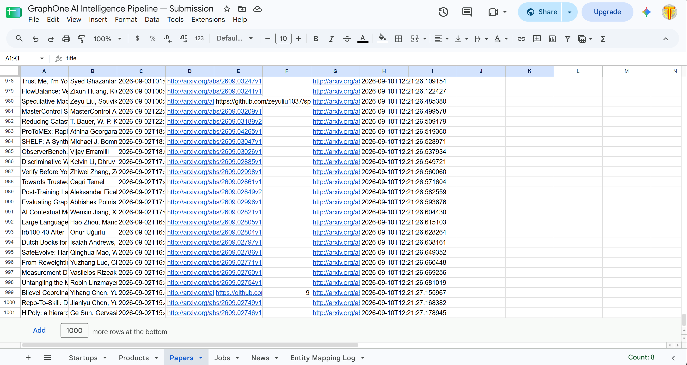

# GraphOne AI Intelligence Pipeline

Automated pipeline that crawls, extracts, deduplicates, and exports AI ecosystem data.

## What it collects
- 1,000+ AI startups (Y Combinator directory)
- 1,000+ AI products (GitHub awesome lists)
- 1,000+ research papers (arXiv CS.AI)
- AI news from 5 sources (last 24h only)
- AI jobs from 5 sources (last 24h only)

## Architecture
Sources → Async Crawlers → SQLite → LLM Extraction → Entity Resolution → Google Sheets

## Setup

1. Clone the repo
2. Create virtual environment: `python -m venv venv`
3. Activate: `venv\Scripts\activate` (Windows) or `source venv/bin/activate` (Mac/Linux)
4. Install dependencies: `pip install -r requirements.txt`
5. Copy `.env.example` to `.env` and fill in API keys
6. Add `credentials.json` (Google service account)
7. Run: `python main.py`

## Environment Variables
GROQ_API_KEY=your_key_here
GEMINI_API_KEY=your_key_here
GITHUB_TOKEN=your_token_here
GOOGLE_SHEETS_ID=your_sheet_id_here
DEEPSEEK_API_KEY=your_key_here

## How each part works

**Crawlers** — async aiohttp crawlers with rate limiting and polite delays.

**Date filtering** — news and jobs are filtered to last 24 hours only using multi-strategy date extraction (meta tags, JSON-LD, time elements, relative dates).

**LLM extraction** — Groq → Gemini → DeepSeek fallback chain with exponential backoff on rate limits. LLM only extracts, never invents.

**Deduplication** — SHA-256 hash of source URL stored in seen_urls table. Duplicate URLs are silently skipped.

**Entity resolution** — fuzzy matching (rapidfuzz) against seed list of 70+ canonical AI company names. All mappings logged to Entity Mapping Log tab.

## Running individual scrapers
python -m src.crawlers.papers
python -m src.crawlers.news
python -m src.crawlers.jobs
python -m src.crawlers.startups
python -m src.crawlers.products
python -m src.storage.sheets

## Google Sheets output
[Link to sheet](https://docs.google.com/spreadsheets/d/1FXHS9cuOqoH1Yktw1rIuRzKUbjIA_RDxZX7AJ4N1YN4/edit?gid=0#gid=0)
